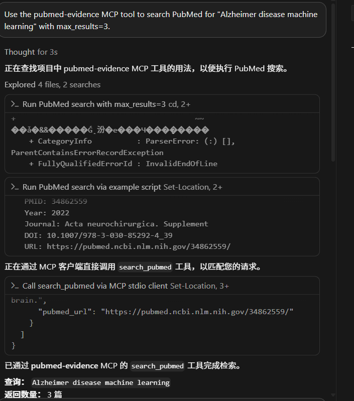

# mcp-pubmed-evidence

MCP server for reliable PubMed literature retrieval, BibTeX export, and evidence table generation for biomedical research agents.

This project exposes PubMed as structured MCP tools so AI assistants can retrieve biomedical literature with source URLs, PMID/DOI metadata, article types, and citation-ready outputs instead of relying on model memory.

## Status

Early development. The first version focuses on PubMed metadata retrieval and citation provenance.

## Features

- Search PubMed with optional year and publication type filters
- Search ClinicalTrials.gov by query, condition, intervention, status, and result limit
- Report result-limit metadata, including requested limits, effective limits, returned counts, and truncation flags
- Fetch normalized metadata for a PubMed article by PMID
- Export PubMed records as BibTeX entries
- Build compact evidence tables for agent workflows
- Return structured PubMed fields such as PMID, title, authors, journal, year, DOI, abstract, article types, and PubMed URL
- Return structured trial fields such as NCT ID, condition, intervention, phase, status, enrollment, outcomes, locations, sponsors, and linked publication references

## Why MCP for Biomedical Evidence

Biomedical research agents need reliable access to current, source-backed evidence. A plain chatbot can answer from model memory, but it may miss recent papers, blur study types, or provide weak citations. This MCP server gives agents a controlled tool layer for PubMed retrieval, ClinicalTrials.gov trial registry retrieval, structured metadata, citation export, and evidence-table generation.

The goal is not to make medical decisions. The goal is to help agents retrieve and organize biomedical literature with provenance, stable schemas, and clear source URLs.

## Safety scope

This server is intended for biomedical research support, literature discovery, citation management, and evidence organization. It is not intended for diagnosis, treatment recommendations, or medical advice.

## Installation

```powershell
git clone https://github.com/Tianyu-Qu/mcp-pubmed-evidence.git
cd mcp-pubmed-evidence
python -m venv .venv
.\.venv\Scripts\Activate.ps1
pip install -e .[dev]
```

For macOS/Linux, activate the virtual environment with:

```bash
source .venv/bin/activate
```

## MCP Configuration

This server uses MCP stdio transport and can be used by any MCP-compatible client.

Generic stdio configuration:

```json
{
  "command": "python",
  "args": ["-m", "mcp_pubmed_evidence.server"],
  "env": {
    "PYTHONPATH": "/path/to/mcp-pubmed-evidence/src"
  }
}
```

Claude Desktop example:

```json
{
  "mcpServers": {
    "pubmed-evidence": {
      "command": "python",
      "args": ["-m", "mcp_pubmed_evidence.server"],
      "env": {
        "PYTHONPATH": "/path/to/mcp-pubmed-evidence/src"
      }
    }
  }
}
```

Replace `/path/to/mcp-pubmed-evidence/src` with the absolute path to your local `src` directory. On Windows, it may look like `C:\\path\\to\\mcp-pubmed-evidence\\src`.

If you install the project into the same Python environment used by your MCP client, you can omit `PYTHONPATH`.

If your network requires a proxy, add `HTTP_PROXY` and `HTTPS_PROXY` to `env`:

```json
"HTTP_PROXY": "http://127.0.0.1:7890",
"HTTPS_PROXY": "http://127.0.0.1:7890"
```

## Local Demo

You can test PubMed retrieval without an MCP client:

```powershell
python examples/search_pubmed.py "Alzheimer disease machine learning" --max-results 3
```

With a year filter:

```powershell
python examples/search_pubmed.py "Alzheimer disease machine learning" --max-results 5 --year-from 2022 --year-to 2026
```

Search ClinicalTrials.gov without an MCP client:

```powershell
python examples/search_trials.py --condition "Alzheimer disease" --intervention "GLP-1" --max-results 5
```

Build a unified PubMed + ClinicalTrials.gov evidence table without an MCP client:

```powershell
python examples/build_biomedical_evidence_table.py --query "Alzheimer disease machine learning" --condition "Alzheimer disease" --max-pubmed-results 2 --max-trial-results 2
```

To print the same rows as JSON:

```powershell
python examples/build_biomedical_evidence_table.py --query "Alzheimer disease machine learning" --condition "Alzheimer disease" --max-pubmed-results 2 --max-trial-results 2 --json
```

Example outputs are available in `examples/sample_search_output.json`, `examples/sample_trial_output.json`, and `examples/sample_biomedical_evidence_table.json`.

You can also verify the MCP stdio server locally by listing its tools:

```powershell
python examples/mcp_list_tools.py
```

Expected tools:

```text
search_pubmed
get_pubmed_article
get_abstract
export_bibtex
build_evidence_table
search_trials
get_trial_summary
map_trial_to_publications
build_biomedical_evidence_table
```

## Demo

Verified with Cursor as an MCP client. Cursor connected to the `pubmed-evidence` server and called the `search_pubmed` tool for the query `Alzheimer disease machine learning` with `max_results=3`.



Additional result screenshots:


## Tools

### `search_pubmed`

Search PubMed and return normalized article metadata.

Search responses include `metadata` with `requested_max_results`, `effective_max_results`, `max_allowed_results`, `returned_count`, `total_available` when available, and `truncated`.

Inputs:

- `query`: PubMed search query
- `max_results`: maximum number of articles to return, capped at 50
- `year_from`: optional publication year lower bound
- `year_to`: optional publication year upper bound
- `article_types`: optional publication type filters, such as `Review` or `Randomized Controlled Trial`

### `get_pubmed_article`

Fetch one PubMed article by PMID.

### `export_bibtex`

Fetch PubMed articles by PMID and export BibTeX entries.

### `build_evidence_table`

Fetch PubMed articles by PMID and return compact evidence table rows.

### `search_trials`

Search ClinicalTrials.gov and return compact trial records.

Search responses include `metadata` with result-limit and truncation information.

Inputs:

- `query`: optional general trial query
- `condition`: optional condition or disease filter
- `intervention`: optional intervention, drug, or device filter
- `status`: optional recruitment status filter
- `max_results`: maximum number of trials to return, capped at 50

### `get_trial_summary`

Fetch one ClinicalTrials.gov trial by NCT ID and return detailed structured metadata including arms, outcomes, eligibility, locations, sponsors, collaborators, references, and result references.

### `map_trial_to_publications`

Map one ClinicalTrials.gov NCT ID to linked PubMed publications when PMIDs are available in ClinicalTrials.gov references.

### `build_biomedical_evidence_table`

Build a unified biomedical evidence table from PubMed articles and ClinicalTrials.gov trial records.

Inputs:

- `query`: optional PubMed query and optional trial query
- `condition`: optional condition or disease filter for ClinicalTrials.gov
- `intervention`: optional intervention, drug, or device filter for ClinicalTrials.gov
- `max_pubmed_results`: maximum PubMed records to include
- `max_trial_results`: maximum ClinicalTrials.gov records to include

Returns `metadata` plus integrated evidence `rows`. Rows include source type, source ID, title, date/year, study type, status, phase, conditions, interventions, outcomes, DOI, URL, and provenance.

The metadata includes requested/effective PubMed and ClinicalTrials.gov result limits, maximum allowed limits, returned row count, and whether a requested limit was truncated.

## Development

Run tests:

```powershell
pytest
```

Run linting:

```powershell
ruff check .
```

## Limitations

- PubMed and ClinicalTrials.gov metadata can be incomplete; DOI, abstract, author, journal, publication date, outcomes, locations, or linked PMIDs may be missing.
- Evidence tables are metadata-oriented in the first version and do not extract PICO elements or judge study quality.
- Result limits are capped to keep MCP responses manageable; tools report truncation metadata when a request exceeds the configured limit or when a source reports more available records than returned.
- The server does not provide diagnosis, treatment recommendations, or medical advice.
- Network access to PubMed may require a proxy depending on the user's environment.
- Tool outputs should be reviewed by a human before being used in manuscripts, clinical documents, or systematic reviews.

## Release Notes

See [CHANGELOG.md](CHANGELOG.md) for v0.1.0 release notes.

## v0.3.0 Development

The next milestone, `v0.3.0 Evidence Table 2.0`, introduces a unified biomedical evidence row schema for combining PubMed articles and ClinicalTrials.gov trial records. The `build_biomedical_evidence_table` MCP tool now returns integrated evidence rows with source provenance.

## v0.4.0 Development

The `v0.4.0 Evidence Quality & Safety` milestone adds guardrails for agent-facing biomedical tools. The first improvement adds explicit result-limit and truncation metadata so MCP clients can tell when a response was capped.

## Roadmap

- Expand ClinicalTrials.gov result fields and examples
- Add OpenAlex/Crossref DOI resolution
- Add richer evidence table extraction
- Add example MCP client configurations
- Add local PDF library support
